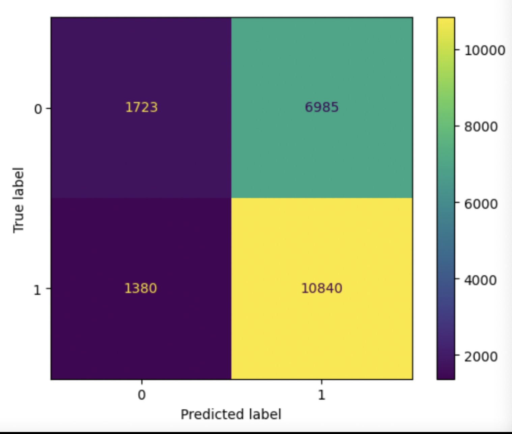

# Recipe labeling specifically for label "Dietary" 
# Predict if the recipe would be labled as "dietary" or not.

## Framing the Problem
### Our Prediction Problem
In today's health-conscious world, there is a growing demand for dietary recipes that cater to specific dietary needs and preferences. Therefore, this model is built helping to predict whether or not one recipe would be tagged with the label "dietary" in food.com given features "ingredients"(ingredients used in the recipe), "minutes"(minutes to prepare recipe), "description"(user-provided description to the recipe), "protein (PDV)", "carbohydrates (PDV)" and "calories (#)".
 
### Why this Response Variable?
Our response variable would be "if dietary", either "would be tagged as dietary" or "would not be tagged as dietary" which can be extracted from their tags from the existing dataset for modeling. The reason why we picked this variable is because people are now focusing more and more on their health, and our model aimed to better help the website label their dietary recipes for users who are on diets. These are features that would be available upon time of prediction since the labeling happened after we gain all the information about the recipe, once the user successfully and fully put in all required elements to build the recipe. 
 
### Why F1 as metrics?
Since the prediction only involves yes and no questions, it would be a binary classification problem. We did not choose accuracy because there is a class imbalance between the "would be tagged as dietary" or "would not be tagged as dietary" two classe. The matrices we are using to evaluate our model are F1 since we would take account of the TP(True positive), TN(True negative), FP(False positive),FN(False negative) of the model. When we predict whether it is dietary, we don't give a preference to minimize the FP or FN. Instead, we want to achieve a balance in precision and recall. Thus, F1 distinguishes out of precision or recall.
 
## Baseline Model
### About Our Model
We create a tree decision model for our baseline model. Before training the data, we split our dataset into 75% and 25% as training and testing datasets. The hyperparameter we picked are max_depth = 6, criterion = "gini",min_samples_split = 100 since there are 6 features, and "gini" work well with imbalanced data.
 
The features we took into our model are "ingredients", "minutes", "description", "protein (PDV)", "carbohydrates (PDV)","calories (#)" which would all be available if at the time of prediction. Among those features, we have 2 categorical and 4 numerical, ingredients(list with ingredients as elm), "description"(a string describing the recipe) are nominal features, and the rest("minutes", "protein(PDV","carbohydrates (PDV)","calories (#)" are quantitative features.
 
### How Do We Encode Categorical Data?
Before building our baseline model, we first conducted feature engineering on the two nominal features("description" and "ingredients"). 
 
For "description", we found that words like "healthy", "low-calorie","gluten-free" and "organic" are likely to be in dietary recipes, therefore we wrote our own FunctionTransformer to transform the "description" feature into True for "having one of these words in the description" and False for "do not have any of them in the description". *True and false can be evaluated as 1 and 0
 
For "ingredients", we found that dietary recipes are not likely to have "chocolate" or "bacon" as ingredients. Therefore, we then wrote our own FunctionTransformer to transform the "ingredients" feature into the total occurrence of these two words appearing in the recipes. We use a pipeline to transform and also one-hot encode it.
 
Moreover, dietary labeled recipes can also have many unique characteristics in menu descriptions, ingredients used, and also nutrition facts. The reason why we choose those features is that dietary recipes are tended to have special ingredients and without certain ingredients, are less time-consuming, have a good balance of nutrition components, and have likely to have certain words in the recipe descriptions. 
要改
### F1 score and Comments
We run the F1 score several times on the trained dataset, and the F1 remains at about 0.71958. Also, the tested data shows a constant accuracy rate of about 0.71538. However, when we calculate the proportion of recipes that have dietary as lable, the proportion is 69%. That is, if the model predicts all the outcome is 5, it can have an accuracy score of 0.69. Our model has a similar F1 score for the testing set(1% higher) and also 1% higher than the model which always predicts as "would be labeled as "dietary" for the testing set which is not very optimal.
 

## Final Model
### What Features Did We Add
Built upon the baseline mode, the two features we addd are based on "minutes","protein (PDV)", "carbohydrates (PDV)" and "calories (#)".
After EDA, we found that recipes with label "dietary" are less time-consuming and are more likely to be under 30minutes and minutes has a wide range with extremely large max. Therefore, we perform a Binarizer transformation on "minutes" with threshold 30. By doing this, we divided the recipes in two groups, "with minutes under 30 minutes" and "with minutes above 30 minutes". By doing this, we reduce the dementional of "minutes" and eliminate the extremely large outlier's impact on our model. Then, we also perform QuantileTransformer on the columns "protein (PDV)", "carbohydrates (PDV)" and "calories (#)". Since they are all columns related to the nurtrients and have different scalers, so it is not reasonable to leave them as the raw data. Through QuantileTransformer, we can handle the skewed data, as well as taking care of the effect of outliers, while still perserving the relative relationship. 
 

### Model Basics and Grid Search
To compare with the baseline model, we use the same train and test dataset used in baseline model. We still use decision tree because it is still a good choice in classification prediction. To decide the hyperparameters, we perform a GridSearch before training the data. We choose 10 different max_depths, 2 kinds of criterion, and 7 min_samples_split numbers. After training the 140 kinds of combinatio, it comes to the best combination: {'criterion': 'gini', 'max_depth': 7, 'min_samples_split': 50}, and we unpack this combination into our final model.
 
### F1 score and Comments
The F1 score in final model for training dataset is 0.72546 and for test dataset is 0.72158. For both of training and testing dataset, the F1 score increases by 1%. An increase by 1% represents the increase in both precision and recall. Also, we attached a confusion matrix below about the distribution of TP, TN, FN, and FP.
 

According to the diagram, the section with the largest number is TP with about 50% dataset there. For the FN and FP part, FP is about 5 times higher than the FN number. This is likely to raise from the bias in dataset itself since the proportion of recipes with "dietary" in tag is higher than recipes without. So as the false prediction, FP is much higher than FN.

## Fairness Analysis
### Hypothesis
In this section, we want to evaluate whether this model is fair. The one variable that relates to whether "dietary" or not is calories number. We want to explore whether this model can gives the same F1 score for calories in different levels. For this question, we will categorize calories to "high_cal", which is higher than and equal to the median calories number in the dataset, and "low_cal" which is lower than the median. We use median as threshold is to have the similiar number of data for those two categories. 
 
Null Hypothesis: Our model is fair. Its F1 score for predicting dietary recipe with high calories and low calories are roughly the same, and any differences are due to random chance. 
Alternative Hypothesis: Our model is unfair. Its precision for young people is lower than its precision for old people.
 
### Conclusion
<iframe src="test.html" width=800 height=600 frameBorder=0></iframe>
 

